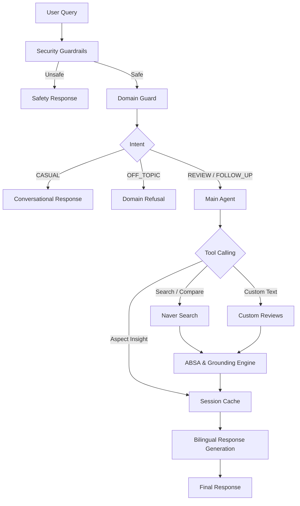

# 🔍 ReviewLens
> See Beyond the Star Rating — AI-Powered Korean Restaurant Review Analyzer

ReviewLens is a lightweight agentic AI system for analyzing Korean restaurants and reviews with Aspect-Based Sentiment Analysis (ABSA).It turns noisy Korean restaurant reviews into structured, explainable, evidence-grounded dining intelligence. Instead of delivering vague summary scores, it decomposes review sentiment by specific aspects (**FOOD**, **PRICE**, **SERVICE**, **AMBIENCE**) and grounds every claim directly in verbatim Korean source quotes.

---

## 🌟 Why ReviewLens?

Restaurant reviews often pack conflicting signals into a single sentence—praising the food while criticizing long wait times or poor service. ReviewLens resolves this by decomposing sentiment per aspect and enforcing strict evidence-grounding:

* **Decomposed Insights**: Isolates sentiment across four core restaurant categories.
* **100% Verbatim Evidence**: Grounded in actual review substrings—no unsupported generative summaries.
* **Dual-Boundary Security**: Hardened against prompt injection attacks at both the user query and custom review data entry points.
* **Bilingual Analysis**: Preserves original Korean review quotes while delivering English contextual explanations.

---

## 📊 Core Capabilities

| Capability | Description | Example Query |
| :--- | :--- | :--- |
| **Restaurant Analysis** | Aggregates Naver blog reviews, scores 4 aspects, and validates top pros/cons. | `"삼청동수제비 분석해줘"` |
| **Aspect Deep Dive** | Extracts sentiment metrics and verbatim quotes for a specific aspect from session context. | `"How is the service at 삼청동수제비?"` |
| **Restaurant Comparison** | Conducts side-by-side aspect score comparisons with supporting evidence. | `"봉피양이랑 삼청동수제비 비교해줘"` |
| **Custom Text Analysis** | Analyzes user-provided raw review text through Boundary 2 security checks. | `"Analyze: 음식은 맛있었지만 불친절했어요."` |
| **Domain-Guarded Chat** | Handles follow-ups seamlessly while rejecting off-topic prompts politely. | `"What did people complain about?"` |

---


# 🏗️ System Architecture



### 🔄 Data Flow

1. **User Query Validation**: User input passes through Boundary 1 Security Guardrails to block injection attempts before reaching the LLM.
2. **Intent & Skill Routing**: Domain Guard skill classifies intent into `REVIEW`, `FOLLOW_UP`, `CASUAL`, or `OFF_TOPIC` categories.
3. **Data Retrieval / Custom Input**:
   * *Restaurant queries*: Trigger Naver Blog Search API to fetch raw review text snippets.
   * *Custom review input*: Passes through Boundary 2 Security Guardrails to sanitize untrusted review text.
4. **Batch ABSA Processing**: `ABSAOrchestrator` chunks reviews and sends them to Groq (`openai/gpt-oss-120b`) for sentiment analysis.
5. **Evidence Validation**: `ABSAOutputValidator` verifies that extracted evidence quotes exist verbatim in the raw review text, filtering out hallucinated quotes.
6. **Metric Aggregation & Caching**: Raw aspect sentiments are aggregated into score ratios per category (`FOOD`, `PRICE`, `SERVICE`, `AMBIENCE`) and cached in session state.
7. **Bilingual Response Generation**:The agent generates clear English explanations and comparison tables while preserving original Korean review evidence verbatim.

---

### 🛠️ Tech Stack

| Layer                     | Technology                                                 |
| ------------------------- | ---------------------------------------------------------- |
| **LLM & Inference**       | Groq API (`openai/gpt-oss-120b`)                           |
| **Agent Architecture**    | Custom Function-Calling Agent with Session State           |
| **Security & Guardrails** | Regex-based validation + Unicode NFKC normalization        |
| **Review Analysis**       | Structured Pydantic schemas + Verbatim Evidence Validation |
| **Review Source**         | Naver Blog Search Open API                                 |
| **Response Generation**   | Bilingual English/Korean-aware response generation         |
| **Configuration**         | Modular Markdown-based Agent Guidelines                    |
| **Testing**               | `pytest`, `pytest-cov`, `unittest.mock`                    |
| **Environment**           | Python 3.10+, `python-dotenv`, `pydantic`                  |

---

## 🛡️ Dual-Boundary Security Architecture

ReviewLens uses two deterministic security boundaries to protect both user input and untrusted review content before it reaches the LLM.

### 1. Boundary 1 — Direct User Input
Intercepts prompt injection, instruction overrides, system-prompt extraction, role manipulation, and jailbreaks before the query reaches the Groq LLM API.

### 2. Boundary 2 — External / Untrusted Review Data
Treats user-provided custom reviews as untrusted data. Before analysis, the system normalizes Unicode, removes control characters, enforces input size limits, and filters embedded prompt injection patterns.

This prevents malicious instructions hidden inside review text from being interpreted as commands during review analysis.
---

## 📂 Project Structure

```text
```text
ReviewLens/
│
├── src/
│   ├── agent.py         # Agent loop, tool selection, session state management
│   ├── absa.py          # Batch processing, chunking, and metric aggregation
│   ├── guardrails.py    # Boundary 1 & Boundary 2 security enforcement
│   ├── groq_client.py   # Groq API client with structured JSON output schema
│   ├── naver.py         # Naver Blog Search API integration & HTML parsing
│   ├── schema.py        # Pydantic schemas (ReviewInput, ReviewABSA, AspectSentiment)
│   └── validator.py     # Verbatim evidence grounding & hallucination filtering
│
├── skills/
│   ├── domain_guard.md             # Intent classification (REVIEW, FOLLOW_UP, OFF_TOPIC, CASUAL)
│   └── bilingual_absa_response.md  # Language and formatting guidelines
│
├── tests/
│   ├── conftest.py
│   ├── fixtures/                  # Test reviews & query datasets
│   ├── unit/                      # Guardrail, ABSA, Schema, Naver, Groq tests
│   ├── agent/                     # Domain taxonomy & Agent execution tests
│   ├── integration/               # Pipeline execution & state persistence
│   └── regression/                # Edge-case bug protections
│
├── pytest.ini
├── app.py                          # Application entry point(streamlit)
├── README.md
├── requirements.txt
└── .gitignore

```

---

# ⚙️ Setup

## 1. Clone the Repository

```bash
git clone <your-repo-url>
cd absa_agent
```

## 2. Install Dependencies

```bash
pip install -r requirements.txt
```

## 3. Configure Nave and Groq API keys
- Groq API Key: Sign up at Groq Console and generate an API key.
- Naver Search API Keys: Register an application on the Naver Developers Portal to receive a Client ID and Client Secret for the Search (검색) API.


## 4. Environment Variables Configuration
Create a `.env file in the root directory.

```python
GROQ_API_KEY=your_groq_api_key_here
NAVER_CLIENT_ID=your_naver_client_id_here
NAVER_CLIENT_SECRET=your_naver_client_secret_here
```

## 5. Run the Application

```bash
streamlit run app.py
```


---

# 🧪 Testing

ReviewLens includes a comprehensive test suite built with `pytest` and `pytest-cov` to validate security boundaries, state persistence, quote grounding, and tool execution without external network leakage.

## Test Directory Structure

```text
tests/
├── unit/                      # Fast, isolated unit tests
│   ├── test_guardrails.py    # Boundary 1 (Query) & Boundary 2 (Review) security tests
│   ├── test_absa.py          # ABSA pipeline execution, chunking, and math metrics
│   ├── test_schema.py        # Pydantic schema validation
│   ├── test_naver.py         # Naver API parsing and HTML tag removal
│   └── test_groq_client.py   # Groq engine JSON schema parsing and API mocks
│
├── agent/                     # Agent reasoning and domain tests
│   ├── test_domain_guard.py  # Intent taxonomy classification (REVIEW/FOLLOW_UP/OFF_TOPIC)
│   └── test_agent.py         # Tool call loop, security blocking, and context updates
│
├── integration/               # Pipeline execution tests
│   └── test_pipeline.py      # End-to-end flow & session state retention checks
│
├── regression/                # Regression protection against fixed bugs
│   └── test_regression.py    # Verbatim short Korean phrase preservation
│
├── fixtures/                  # Reusable mock datasets
│   ├── test_reviews.json     # Valid, dirty, and injection review examples
│   └── test_queries.json     # In-domain, follow-up, off-topic, and injection prompts
│
└── conftest.py                # Shared pytest fixtures and mock objects
``` 

## Running Tests

``` bash
# Run all tests
pytest

# Run tests by marker
pytest -m unit
pytest -m agent
pytest -m integration

# Run specific test modules
pytest tests/unit/test_guardrails.py -v
pytest tests/agent/test_agent.py -v

# Generate HTML coverage report
pytest --cov=src --cov-report=html
```

## 📊 Test Coverage Summary

The current ReviewLens test suite contains **33 automated tests**, all of which are passing successfully.

### Current Test Results

```
33 test passed in 8.95s
```
### Coverage Report
ReviewLens includes a layered pytest suite covering security,
domain routing, agent behavior, ABSA processing, external API
parsing, schema validation, and regression cases.

Current coverage:

**86% overall**

| Component | Coverage |
|---|---:|
| Schema | 100% |
| Guardrails | 91% |
| ABSA | 89% |
| Groq Client | 87% |
| Agent | 84% |
| Naver | 82% |
| Validator | 73% |
| **Overall** | **86%** |


Note on validator.py Coverage (73%): The remaining missed lines are purely defensive logger statements inside fallback branches when ungrounded quotes are dropped. All validation and evidence-grounding logic is fully verified.

### Notebooks

The project also includes notebooks for experimentation, analysis, and validation.
---

## 🎥 Demo
[Watch Demo Video](https://drive.google.com/file/d/1c5G0piF9W7If7Q2DjNsKIJMvfh1hyZcX/preview)


---


# 📈 Future Improvements

- **Dish-level analysis** — identify specific menu items and analyze their sentiment separately from overall FOOD sentiment.
- **Weighted aspect scoring** — allow users to customize the importance of FOOD, PRICE, SERVICE, and AMBIENCE based on their dining priorities.
- **Sentiment timeline trends** — track how restaurant sentiment changes over time and identify emerging positive or negative trends.
- **Multi-source aggregation** — combine review data from additional platforms such as Kakao Map and Google Reviews for broader coverage.
- **Session memory** — remember user preferences across the session

---
